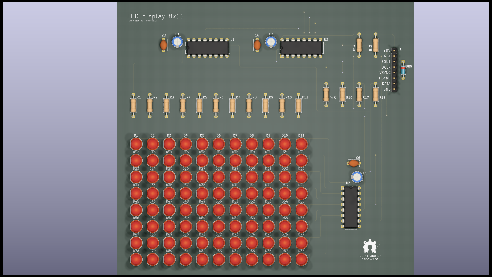
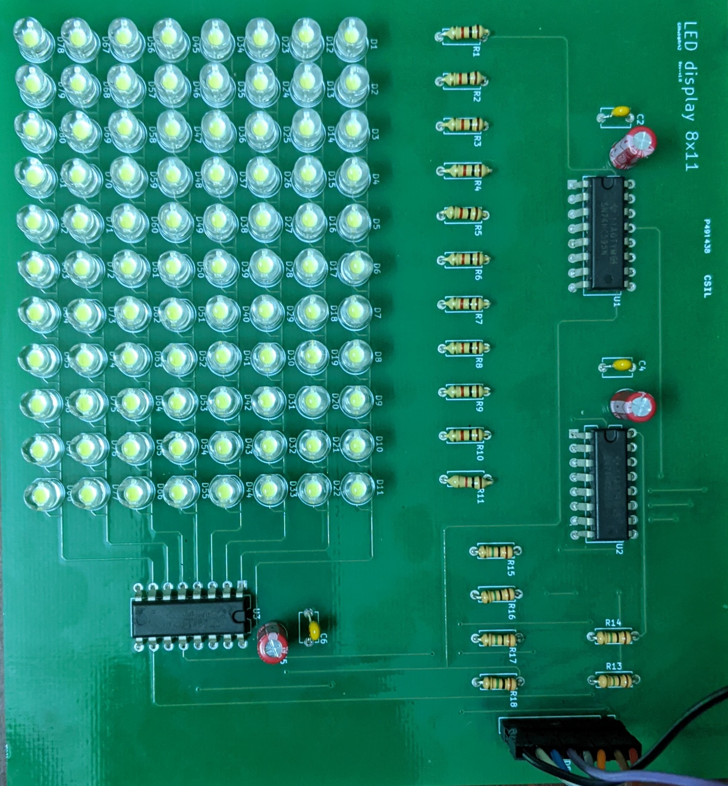

# 8 by 11 LED display
A basic 8x11 LED display that can be driven by an Arduino or a Raspberry Pi board.

The LED matrix and hardware driver are designed using KiCAD (5.1.6) and the layout is made with perfboards in mind, so the front layer can be used as wires and the back layer for solder traces.

> The `Part-list.xlsx` spreadsheet does not reflect the BOM of this project.

### Rendered LED display

### Fabricated and assembled LED display

## Using the Arduino library
To include and use the display library in sketches made using the Arduino IDE, first the library folder follow the below steps:
* Copy the `LED8x11_display_lib` folder from `LED-display/Software` to `My Documents\Arduino\libraries` in Windows, or, `~/Documents/Arduino/libraries/` in linux. For more details refer to the [libraries page](https://www.arduino.cc/en/hacking/libraries) on the Arduino website.
* Include the library in the sketch by mentioning `#include <LED8x11_display_lib.h>` at the top of the sketch.

## License
The Software and firmware of this project is licensed under the the MIT license however the hardware is under the [Open Source Hardware](https://www.oshwa.org/definition/) license.

## To do
* Firmware driver and APIs for Raspberry Pi.
    * Example code (Python and C++)
* Silkscreen for J1 connector pin functions.
* Documentation for hardware
